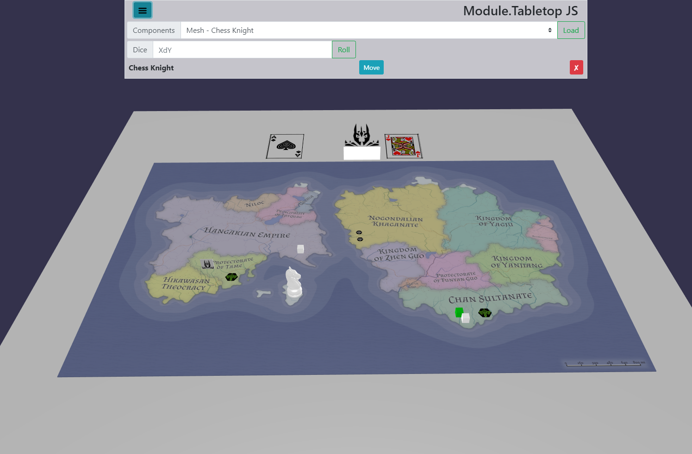

# Module.TabletopJS
A modular tabletop game framework for JS



Sometimes you just want to do a quck mock-up for a game. Or maybe you just don't need all the extras of other systems.  This engine is built to allow you to design and play tabletop games. If you can edit HTML or JSON then you really can create your own boardgame / tabletop experience with this code. 

## How To Mod
Clone the Repo, download, and set up your own local server. Or Fork the repo and create your own mod here on github. Edit the game.js file by adding your own components and templates. The components are pure JS Objects, while the UI is based upon [Vue.js](https://vuejs.org/) and [Bootstrap](https://getbootstrap.com/). 

## Components
You can create / use the following components: Board, Cube, Token, Standee, Card, Deck, and Mesh. Each is described in greater detail below.

Every components is an object with properties. Declare all your components in one large object and update the app, or declare them indivdually and add them to the app as needed. 
```javascript
const myGameComponents = {
  pieceA : {
    title : "Awesome Piece A",
    type : "Cube",
    color : "green"
  },
  pieceB : {
    title : "Awesome Token",
    type : "Token",
    img : "reallyCoolImg.png"
  }
}
//now add them to the app 
app.components = myGameComponents

//You can also declare another component later.
let latecomer = {
  title : "Late Mesh",
  type : "Mesh",
  file : "killerMesh.obj"
  height: 35
}
app.addComponent("lateComer",latecomer)
```
The following properties are generic and may be added to all components:
* **type** (*required*, *string*) - must be one of: "Board", "Cube", "Token", "Standee", "Card", "Deck", or "Mesh"
* **title** (*string*) - the displayed title of the component
* **UI** (*string*) - the name of the Vue.js component that will be loaded to display more information and allow interaction with the component
* **gen** (*string*) - the id of a generator function that will add generated properties to the component. The generator function must eb declaired:
```javascript
app.gen["gen-id"] = (component) => {
  
}
```

### Board
A flat board that displays an image - the core board of a boardgame. 
* **depth** (*number*, default: 800) - the width of the board
* **width** (*number*, default: 600) - the height of the board
* **img** (*required*, *string*) - the image displayed on the board, must be loaded to */boards/*

### Cube
A small cube to be moved around the board.
* **color** (*string*, default: "gray") - the color of the cube, use CSS color strings
* **size** (*number*, default: 10) - the height/width/depth of the cube (in pixels)

### Token
A small disc with an image on one side.
* **size** (*number*, default: 10) - the diameter of the disc
* **isHex** (*bool*, default: false) - if set to true the token will be a hexagon shape
* **img** (*required*, *string*) - the image displayed on the token, must be loaded to */tokens/*

### Standee
A small stand with an image on both sides.
* **height** (*number*, default: 20) - the height of the standee
* **width** (*number*, default: 20) - the width of the standee
* **img** (*required*, *string*) - the image displayed on both sides of the standee, must be loaded to */standee/*

### Card
A flat card with an image on one side - like a board, but thinner.
* **depth** (*number*, default: 30) - the width of the card
* **width** (*number*, default: 50) - the height of the card
* **img** (*required*, *string*) - the image displayed on the card, must be loaded to */cards/*. If a spritesheet is used, you must include the "uv" property
* **uv** (*array (4 numbers)*) - If a spritesheet is used for the image, this is the UV index for the specific card. It is best to ready how [Babylon.js](https://doc.babylonjs.com/how_to/createbox_per_face_textures_and_colors#extruded-polygon) handles UV images. 

### Deck
A deck of cards that can be shuffled and drawn. Once drawn the card is placed on the table. The cards may then be discarded. 
* **cardSize** (*array (2 numbers)*) - the [width, height] of the cards in the deck 
* **img** (*required*, *string*) - the top image of the deck, must be loaded to */cards/*. If a spritesheet is used, you must include the "uv" property
* **uv** (*array (4 numbers)*) - If a spritesheet is used for the image, this is the UV index for the specific card. It is best to ready how [Babylon.js](https://doc.babylonjs.com/how_to/createbox_per_face_textures_and_colors#extruded-polygon) handles UV images. 
* **cards** (*required*, *array*) - an array of javascript objects with the following properies:
  * **n** (*number*, default: 1) - The number of this card in the deck
  * **title** - as above
  * **img** - as above
  * **uv** - as above

### Mesh
* **height** (*number*) - the height of the mesh in the game, this does not have to be the height of the mesh in the file
* **file** (*required*, *string*) - the mesh file to load, must be a gltf/obj/stl file loaded to */mesh/*

### Features this Does Have
* Create your own basic components
* Slide components around the board
* Easy mods and extensions through JS / HTML / images / models
* FREE

### Features this Does Not Have
* Gravity Simulation
* Physical Dice
* Fine tune component mobility
